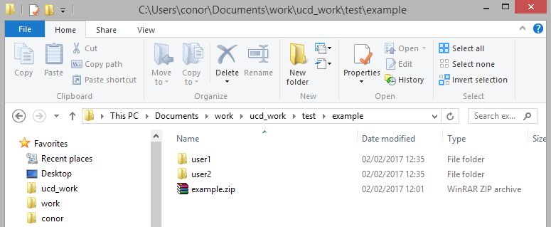
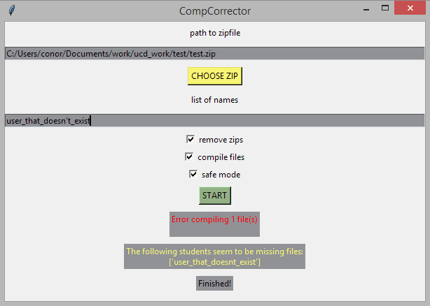

[](https://github.com/ConorSheehan1/comp_corrector/actions/)
[](https://opensource.org/licenses/MIT)
[](https://github.com/psf/black)

## Requirements
1. python 3.6 [tkinter (not provided by pipenv)]  
    ```sudo apt-get install python3 python3-pip python3-tk```
2. gcc (in order to use the compile files option)  
    ```sudo apt-get install gcc musl-dev```
3. You may need to install libxml before running ```pipenv install```  
    ```sudo apt-get install libxml2-dev libxslt-dev python-dev```


## How to use
1. Install pipenv  
    ```pip install pipenv```
2. Install required packages  
    ```pipenv install```
3. Run the UI  
    ```pipenv run ui```  
    
You should see the interface below:


1. Click <kbd>choose zip</kbd> to use the default OS file chooser, or enter the path to your zip directly into the **path to zipfile** field
2. Paste the names of the students you need to correct into the **list of names** field.  
 Names should be separated by newline characters (\n).  
 **(If no names are included, all files in the zip will be extracted)**
3. Choose your preferences
4. Click <kbd>start</kbd>

## Example
1. After clicking <kbd>choose zip</kbd> the default file system your OS uses will open. Choose the zip you want to extract.

2. In this example I will leave the list of names blank so all files in the zip are extracted and use the default settings so all C files are compiled and zips are deleted after extraction.
4. After clicking <kbd>start</kbd> all files in the zip are extracted.

5. If the folders extracted contain zips, they are also extracted. For example in this case, both user1 and user2 contained a zip file, so they were extracted.
6. All C files within the folders (2.c and example.C) are then compiled.
 
7. Once the program completes execution the **finished** label will appear.
 

## Preferences
1. **safe mode** creates a new folder with the same name as the zip and copies the main zip to it before running anything. When enabled the program essentially uses "extract to folder", when disabled it uses "extract here".
2. **remove zips** removes zip files submitted by students (i.e zips within folders within the current working directory) once they have been extracted. The main zip (chosen using the <kbd>choose zip</kbd> button) will not be removed, regardless of the state of this setting.
3. **compile files** uses gcc to compile files and give them the same name as their source file. This feature only works with C files and gcc currently.
4. **feedback.docx** creates a .docx file containing a table with the list of students names in one column and a message to email you with questions in the other. 

## Warnings
1. **Be careful, there's multiple files in the current directory** occurs if safe mode is disabled and there is more one file in the path in the **path to zipfile** field. This warning is to alert the user that the program has access to all files in the directory the zip is in, and may extract or compile files the user did not want to be extracted or compiled.
2. **The following students seem to be missing files** occurs when the program does not find any files beginning with a name the user has provided in the zip file chosen.

 

## Errors
1. **Error compiling files** Occurs when a file doesn't compile successfully. The program will not stop execution, but will increment a counter and then display the number of files which failed to compile.
2. **Exception compiling files** Occurs when attempting to compile a file stops the execution of the program. Once this occurs no further files can be compiled.
3. **Exception parsing names** Occurs if the program encounters a problem splitting the names provided using "\n" or removing single quotes in any of the names.
4. **Exception extracting files** Occurs if there is a general exception causing the program to stop execution.
5. **Exception creating feedback.docx** Occurs most likely due to an import error getting docx, or permission being denied to write to feedback.docx because it is already open.
6. **You must select a zip file to begin** Occurs if the path in the **path to zipfile** field does not end in ".zip"



## Development
Install:  
```pipenv install --dev```

Tests:  
```pipenv run tests```

Linter:  
```pipenv run lint```
